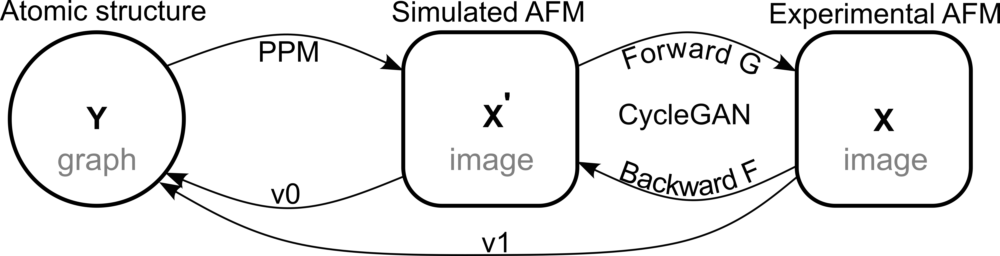
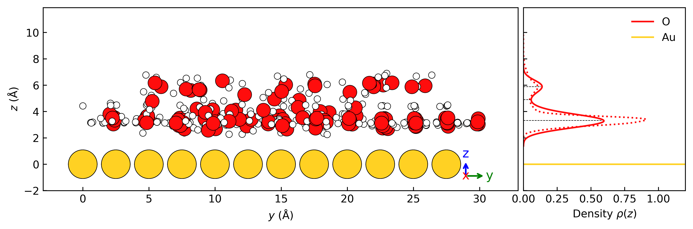
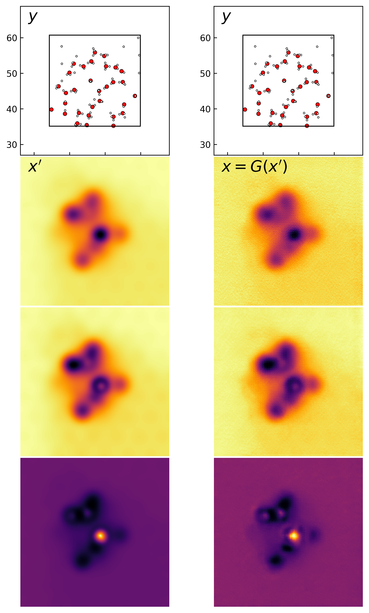
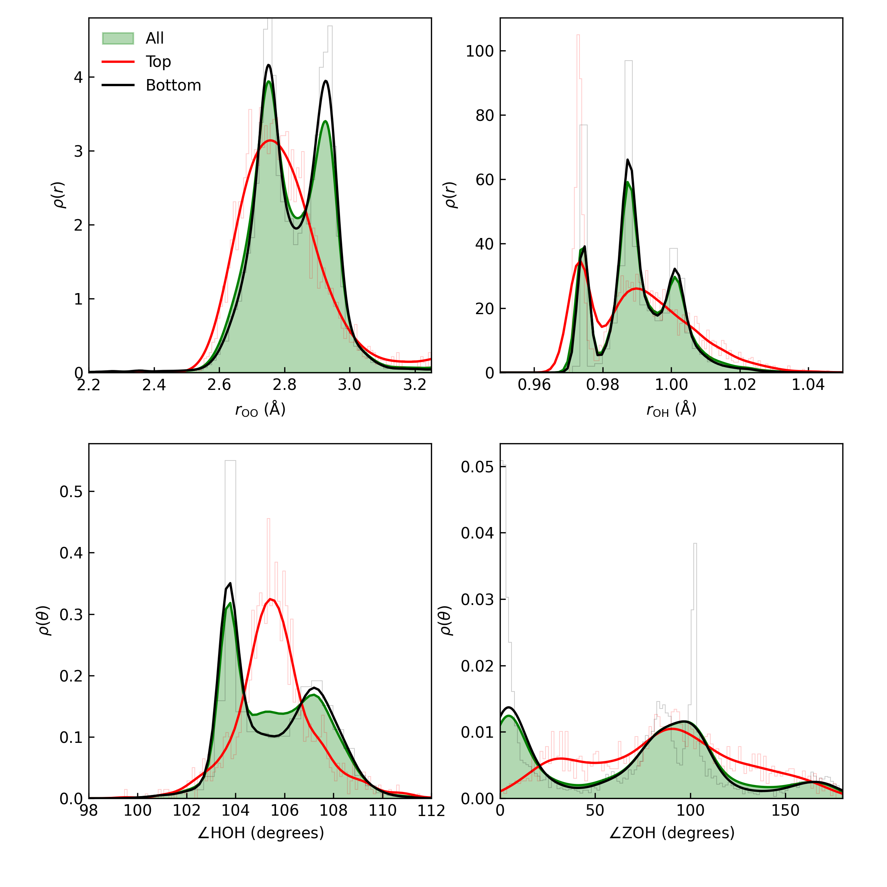

# From computation to experiment style-translated atomic force microscopy images for structure discovery

## Introduction
 

## Training data

| | |
|---|---|
|  |  |


## Theory distributions
### Diantance and angle distributions


`````{tabs}
  ````{tab} Order parameters (Overlay)
    ```{figure} ../results/theoretical_distributions/Label/OrderParameter_Label_overlay_all.png
    :alt: Generated image of a kitchen
    :width: 50%
    ```
  ````

  ````{tab} Order parameters (Row)
    ```{figure} ../results/theoretical_distributions/Label/OrderParameter_Label_row.png
    :alt: Generated image of a kitchen
    :width: 100%
    ```
  ````

  ````{tab} Order parameters (Seperated)
    ```{figure} ../results/theoretical_distributions/Label/OrderParameter_Label_All.png
    :alt: Generated image of a kitchen
    :width: 50%
    ```
    ```{figure} ../results/theoretical_distributions/Label/OrderParameter_Label_Top.png
    :alt: Generated image of a kitchen
    :width: 50%
    ```
    ```{figure} ../results/theoretical_distributions/Label/OrderParameter_Label_Bottom.png
    :alt: Generated image of a kitchen
    :width: 50%
    ```
  ````
`````

## 
