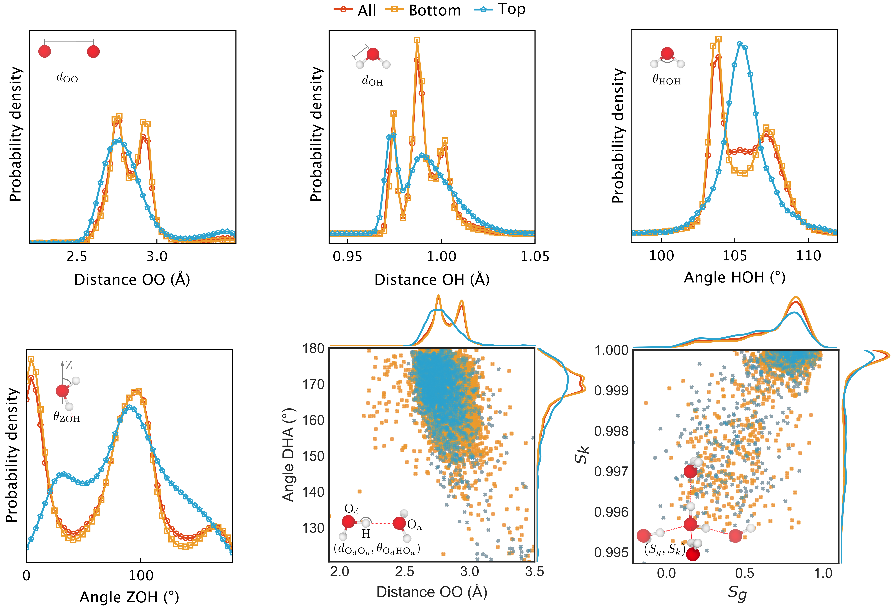

# Performance evaluations

## By eye

## By structual metrics

Theory distributions obtained from simulations

### Wasserstein distance
| |  |
|---|---| 
| Fig. (a) Reference structure: top layer water of  molecues in simulations |  Fig. (b) Reference structure: all bilayer of water molecues in simulations |

### Energy distance
| |  |
|---|---| 
| Fig. (a) Reference structure: top layer water of  molecues in simulations |  Fig. (b) Reference structure: all bilayer of water molecues in simulations |

### Maximum mean discrepancy
| |  |
|---|---| 
| Fig. (a) Reference structure: top layer water of  molecues in simulations |  Fig. (b) Reference structure: all bilayer of water molecues in simulations |

- The distances of the experiment structure predictions are more close the top
  layer water molecues. 
- Performance increases are found on all aspects of properties. (for appropriate
  parameters are chosen in CycleGAN training.)

